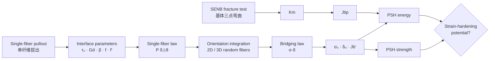
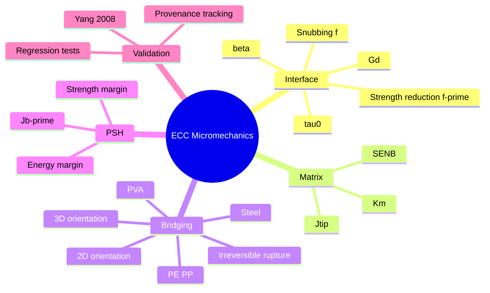
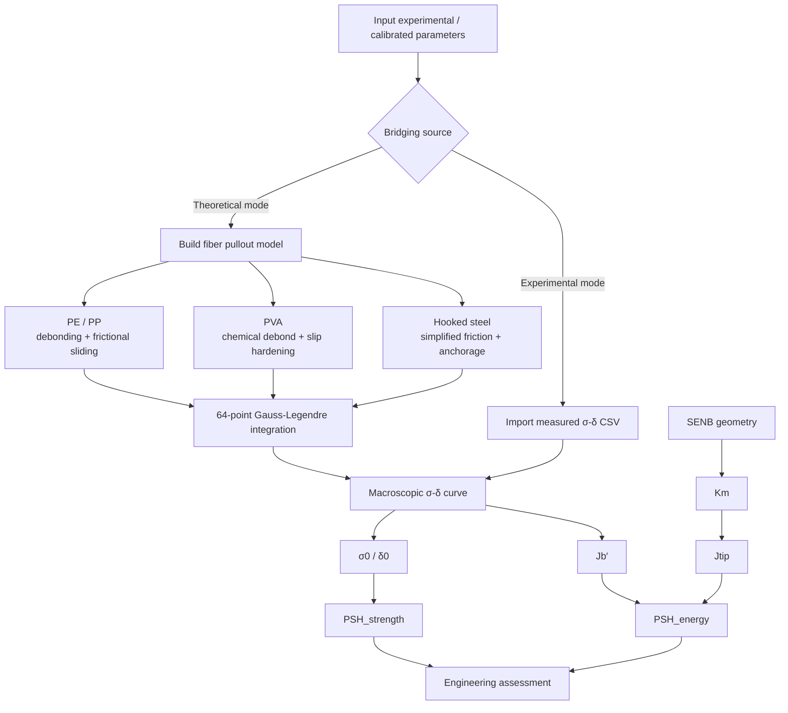
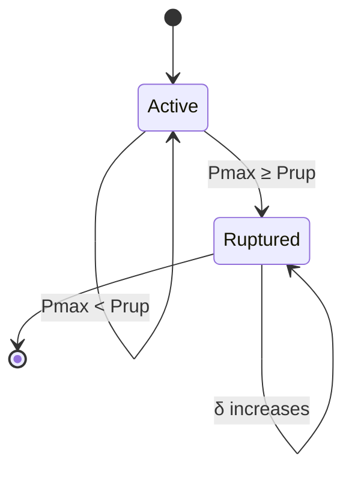
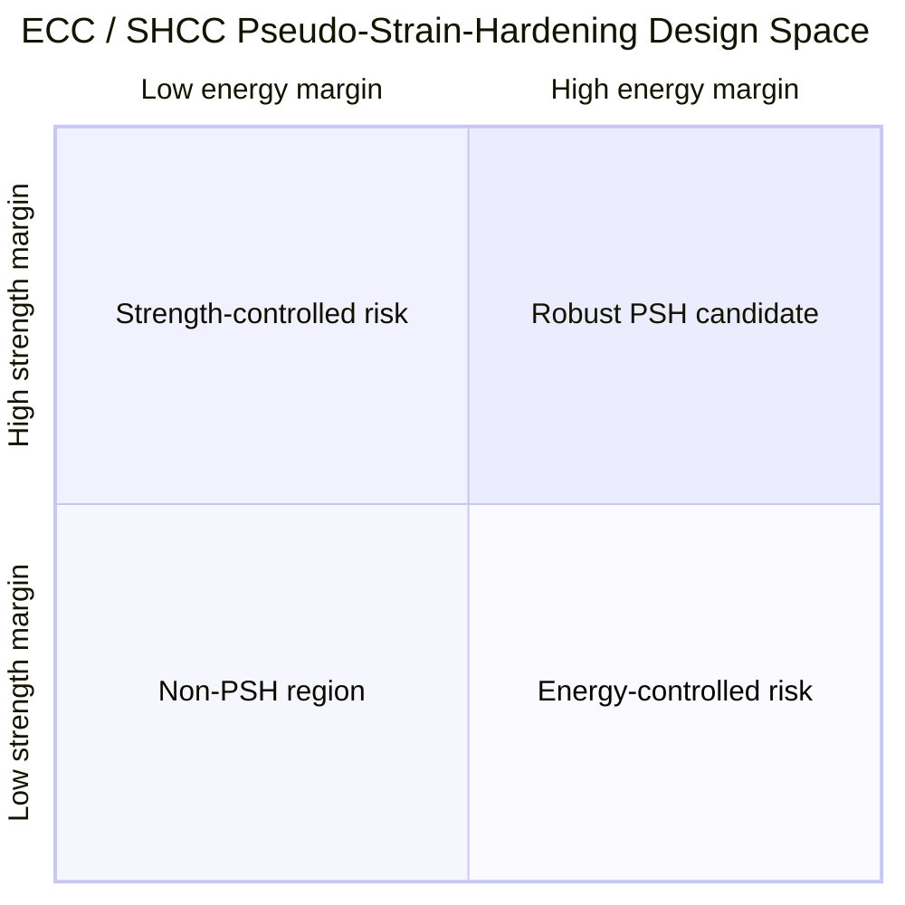
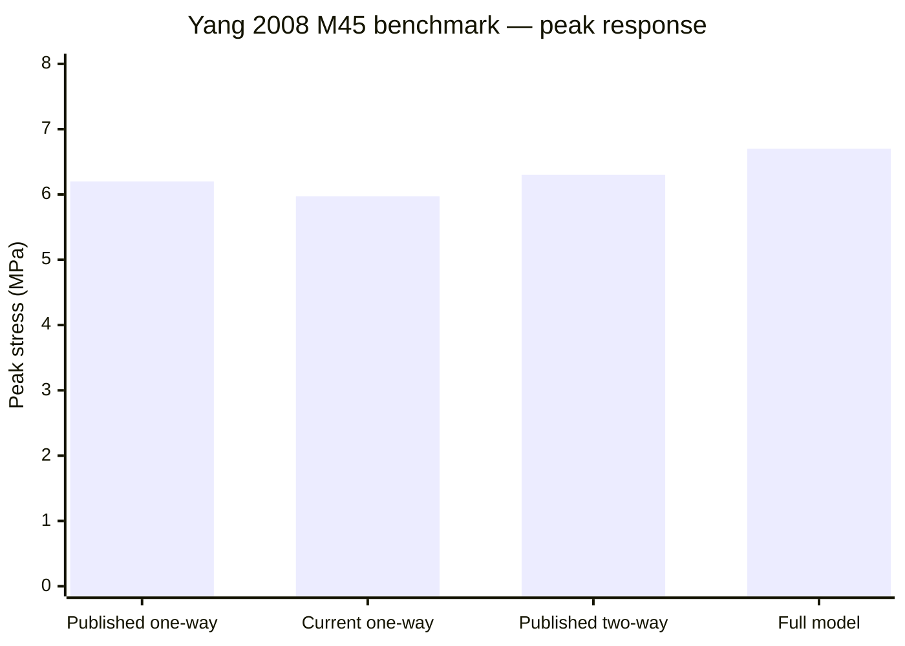
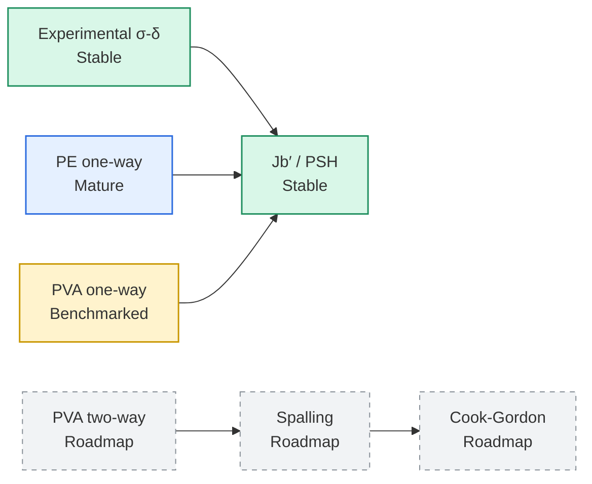
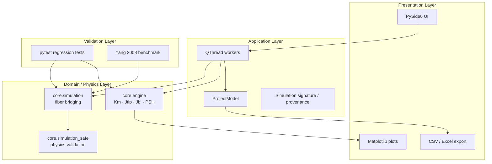
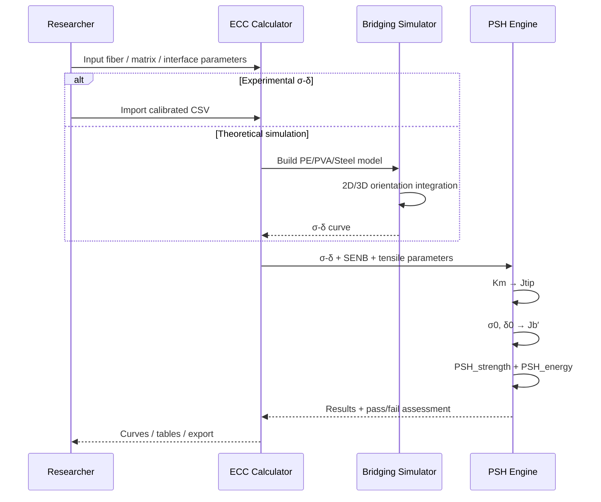
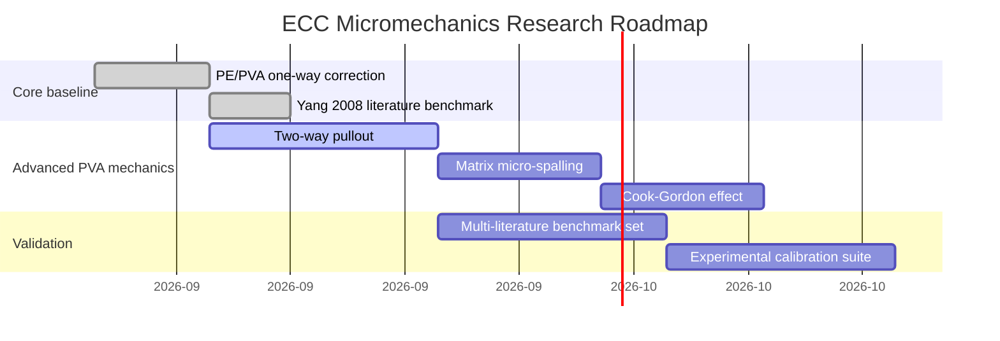

<div align="center">

# ECC Micromechanics Calculator

### Literature-Benchmarked Micromechanics · Fiber Bridging · PSH Evaluation

**工程水泥基复合材料（ECC/SHCC）微观力学计算、桥接本构模拟与伪应变硬化判据平台**

[](https://www.python.org/)
[](https://doc.qt.io/qtforpython-6/)
[](https://scipy.org/)
[](docs/LITERATURE_BENCHMARK.md)
[](docs/LITERATURE_BENCHMARK.md)
[](pyproject.toml)

> **From fiber–matrix interface mechanics to macroscopic strain-hardening assessment.**  
> 将“单纤维拔出 → 基体断裂 → 裂缝桥接 → PSH 双准则”统一到一个可追溯、可验证、可扩展的计算框架中。

</div>

---

## 1. Overview · 项目定位

**ECC Micromechanics Calculator** 面向 Engineered Cementitious Composites（ECC）与 Strain-Hardening Cementitious Composites（SHCC）的材料设计、科研分析与微观力学解释。

项目关注的不是单个经验指标，而是 ECC 形成稳定多缝开裂所需的跨尺度力学平衡：

- **Fiber–matrix interface / 纤维–基体界面**：界面摩擦、化学键、滑移硬化与倾角效应如何控制单纤维承载；
- **Matrix fracture / 基体断裂**：基体断裂韧度与裂尖能量需求如何限制稳态裂缝扩展；
- **Fiber bridging / 纤维桥接**：单纤维拔出响应如何积分为宏观 `σ–δ` 桥接本构；
- **Pseudo strain hardening / 伪应变硬化**：强度裕度与能量裕度是否同时满足稳定多缝开裂条件。



### Core philosophy

> ECC 设计不能只看“强度够不够”，也不能只看“耗能够不够”。  
> **Strength criterion + Energy criterion must be satisfied simultaneously.**

---

## 2. What makes this project different

这个项目并不是“把公式做成 GUI”。当前版本强调四件事：

| Capability | Description | Research value |
|---|---|---|
| **Physics-based** | 从界面、断裂到桥接本构的连续计算链 | 避免只做经验回归 |
| **Traceable** | 模拟参数签名与 `σ–δ` 来源绑定 | 防止参数变了却误用旧曲线 |
| **Benchmarkable** | 内置 Yang et al. (2008) M45 文献回归测试 | 结果不只与自己比较 |
| **Dual-mode** | 实验 `σ–δ` 导入 + 理论桥接模拟 | 同时适合正式分析与机理敏感性研究 |



---

## 3. Scientific workflow · 科学计算链



---

## 4. Micromechanics formulation

### 4.1 Interface frictional bond stress

对于适合用平均摩擦应力近似的单纤维拔出试验：

$$
\tau_0=\frac{P}{\pi d_f L_e}
$$

其中：

| Symbol | Meaning | Unit |
|---|---|---:|
| $P$ | characteristic pullout load | N |
| $d_f$ | fiber diameter | mm |
| $L_e$ | embedment length | mm |
| $\tau_0$ | frictional bond stress | MPa |

> 对 **PVA** 或 **hooked steel**，峰值拔出荷载可能同时包含化学键或机械锚固贡献。当前版本支持 `sim_tau0_override`，可直接输入独立标定的 $\tau_0$，避免 double counting。

---

### 4.2 Matrix fracture toughness

基体单边缺口梁（SENB）采用：

$$
K_m=\frac{P_{max}S}{bd^{3/2}}F\left(\frac{a_0}{d}\right)
$$

程序当前采用 Gross–Srawley / ASTM-style 几何函数，并对其对应的：

$$
\frac{S}{d}\approx4
$$

进行显式校验。若试件跨高比与该几何模型不匹配，程序会拒绝直接套用，而不是静默输出一个看似合理的 $K_m$。

裂尖能量需求：

$$
J_{tip}=\frac{K_m^2}{E_m}
$$

平面应变条件下：

$$
E'=\frac{E_m}{1-\nu^2},\qquad
J_{tip}=\frac{K_m^2}{E'}
$$

---

### 4.3 Fiber bridging law

宏观桥接应力来自大量随机取向纤维的统计积分：

$$
\sigma(\delta)
\propto
\int_0^{\pi/2}\int_0^{L_f/2}
P(\delta,l,\theta)\,w(\theta)\,dl\,d\theta
$$

其中 $P(\delta,l,\theta)$ 为单纤维拔出力。

#### 3-D isotropic random fibers

$$
w_{3D}(\theta)=\sin\theta\cos\theta
$$

#### 2-D planar random fibers

$$
w_{2D}(\theta)=\frac{2}{\pi}\cos\theta
$$

当前数值积分使用 **64-point Gauss–Legendre quadrature**，用于在稳定精度下提高整条 `σ–δ` 曲线扫描效率。

---

### 4.4 Inclination effects

倾角对纤维桥接的影响被拆成两个不同机制：

#### Snubbing amplification

$$
P(\theta)=P(0)e^{f\theta}
$$

#### Inclination-dependent tensile strength reduction

$$
\sigma_{fu}(\theta)=\sigma_{fu}(0)e^{-f'\theta}
$$

代码中 `f` 与 `f′` 分开输入，避免将“倾角增加拔出阻力”和“倾角降低有效纤维强度”混成同一个经验系数。

---

### 4.5 Irreversible fiber rupture

纤维断裂是 **path-dependent / 路径相关** 的。

程序判断的是：

$$
\max_{0\le s\le\delta} P(s,l,\theta)
$$

是否曾超过当前倾角下的纤维承载极限。一旦超过，后续所有更大裂缝开口下该纤维贡献均保持为零。



这避免了传统逐点独立计算中可能出现的“纤维已经断裂，后续因为瞬时拔出力下降又重新承载”的非物理现象。

---

## 5. Complementary energy & PSH criteria

从桥接曲线提取峰值：

$$
(\delta_0,\sigma_0)=\operatorname*{arg\,max}_{\delta}\sigma(\delta)
$$

桥接互补能：

$$
J_b'=\sigma_0\delta_0-\int_0^{\delta_0}\sigma(\delta)d\delta
$$

### Strength criterion

$$
PSH_{strength}=\frac{\sigma_0}{\sigma_{fc}}
$$

### Energy criterion

$$
PSH_{energy}=\frac{J_b'}{J_{tip}}
$$

当前工程判据：

| Criterion | Threshold | Interpretation |
|---|---:|---|
| $PSH_{strength}$ | $\ge 1.3$ | 桥接峰值相对初裂强度具有足够强度裕度 |
| $PSH_{energy}$ | $\ge 2.7$ | 桥接互补能相对裂尖能量需求具有足够裕度 |



> `quadrantChart` 用于表达设计空间概念；正式判定仍以实际计算得到的 PSH 数值为准。

---

## 6. Two calculation modes

### Mode A — Experimental / calibrated `σ–δ`

**推荐用于最终论文定量 PSH 结论。**

CSV 格式：

```csv
delta,sigma
0.000,0.000
0.020,1.850
0.040,3.260
0.080,5.120
0.120,5.880
```

- `delta`: crack opening, mm
- `sigma`: bridging stress, MPa

程序会进行：

```text
CSV ingestion
  ├─ numeric coercion
  ├─ NaN / Inf filtering
  ├─ negative-value rejection
  ├─ delta sorting
  ├─ duplicate handling
  └─ source provenance tagging
```

### Mode B — Theoretical bridging simulation

用于：

- micromechanics sensitivity analysis；
- 纤维参数设计；
- 界面参数影响趋势研究；
- 缺少直接桥接曲线时的机制性估算。

支持的主要物理参数包括：

```yaml
fiber:
  type: PE | PVA | STEEL
  Vf: volume_fraction
  Lf: fiber_length_mm
  df: fiber_diameter_mm
  Ef: fiber_modulus_GPa
  sigma_fu: tensile_strength_MPa

interface:
  tau0: frictional_bond_MPa
  Gd: chemical_debond_energy_J_m2
  beta: slip_hardening_coefficient
  f: snubbing_coefficient
  f_prime: inclination_strength_reduction

orientation:
  mode: 2d | 3d

numerics:
  integration: Gauss-Legendre
  quadrature_order: 64
```

---

## 7. Literature benchmark · Yang et al. (2008)

当前理论桥接模型不是只通过“自己生成的数据”测试，而是加入了公开文献 benchmark。

### M45 PVA-ECC benchmark

Yang, E.-H.; Wang, S.; Yang, Y.; Li, V. C. (2008), *Fiber-Bridging Constitutive Law of Engineered Cementitious Composites*, Journal of Advanced Concrete Technology, 6(1), 181–193.

文献 2 vol.% PVA 参数包括：

| Parameter | Published value |
|---|---:|
| $d_f$ | 39 μm |
| $L_f$ | 12 mm |
| $E_f$ | 22 GPa |
| $\sigma_{fu}$ | 1060 MPa |
| $f$ | 0.20 |
| $f'$ | 0.33 |
| $E_m$ | 20 GPa |
| $V_f$ | 2 vol.% |
| $\tau_0$ | 1.31 MPa |
| $G_d$ | 1.08 J/m² |
| $\beta$ | 0.58 |

### Published model hierarchy

| Model level | Peak stress | Peak opening |
|---|---:|---:|
| Previous one-way pullout | **6.2 MPa** | **93 μm** |
| Two-way pullout | 6.3 MPa | 130 μm |
| + matrix spalling | 6.7 MPa | 131 μm |
| + Cook–Gordon | 6.7 MPa | 133 μm |

### Current implementation

细化局部扫描结果约为：

$$
\boxed{\sigma_0\approx5.97\ \text{MPa}}
$$

$$
\boxed{\delta_0\approx72\ \mu\text{m}}
$$

相对文献 one-way baseline：

- peak stress error ≈ **−3.8%**；
- peak opening ≈ **23% lower**。



> 当前实现的学术定位是 **Yang/Lin one-way baseline**，并不声称已经实现 two-way pullout、matrix micro-spalling 与 Cook–Gordon 全模型。完整说明见 [`docs/LITERATURE_BENCHMARK.md`](docs/LITERATURE_BENCHMARK.md)。

---

## 8. Model maturity matrix

| Module | Status | Recommended use |
|---|---|---|
| Experimental `σ–δ` → $J_b'$ | ✅ Stable | **Formal quantitative analysis** |
| $K_m$ / $J_{tip}$ / PSH | ✅ Stable | **Formal quantitative analysis** |
| PE/PP one-way bridging | 🟢 Mechanistically mature | Sensitivity + calibrated prediction |
| PVA one-way bridging | 🟡 Literature benchmarked | Mechanistic / semi-quantitative |
| PVA two-way pullout | 🔵 Roadmap | Not implemented yet |
| PVA matrix spalling | 🔵 Roadmap | Not implemented yet |
| Cook–Gordon effect | 🔵 Roadmap | Not implemented yet |
| Hooked steel | 🟡 Simplified | Calibration required |



---

## 9. Software architecture

项目采用“物理核心与 GUI 解耦”的结构，保证核心公式可以在无界面环境下独立测试。



### Repository layout

```text
ECC-Micromechanics-Calculator/
├── core/
│   ├── engine.py               # Km, Jtip, Jb′, PSH
│   ├── simulation.py           # fiber pullout + bridging integration
│   └── simulation_safe.py      # physical consistency guards
├── models/
│   └── project.py              # application data model
├── ui/
│   ├── main_window.py          # PySide6 desktop interface
│   ├── workers.py              # threaded computation
│   └── plot_widgets.py         # scientific visualization
├── utils/
│   ├── io.py                   # CSV ingestion / result export
│   └── export.py               # structured Excel export
├── tests/
│   └── test_literature_benchmark.py
├── docs/
│   ├── MICROMECHANICS_MODEL.md
│   ├── LITERATURE_BENCHMARK.md
│   └── ROADMAP_MICROMECHANICS.md
├── main.py
├── pyproject.toml
└── README.md
```

---

## 10. Installation

### Requirements

- Python **3.10+**
- Windows / macOS / Linux

### Clone

```bash
git clone https://github.com/liqinglq666/ECC-Micromechanics-Calculator.git
cd ECC-Micromechanics-Calculator
```

### Recommended virtual environment

```bash
python -m venv .venv
```

Windows:

```powershell
.venv\Scripts\Activate.ps1
```

macOS / Linux:

```bash
source .venv/bin/activate
```

### Install

```bash
pip install -e .
```

Development environment:

```bash
pip install -e ".[dev]"
```

---

## 11. Run

### Desktop application

```bash
python main.py
```

or after installation:

```bash
ecc-calc
```

### Run tests

```bash
pytest
```

只运行文献 benchmark：

```bash
pytest tests/test_literature_benchmark.py -v
```

---

## 12. Example research workflow



一个典型科研分析顺序：

```python
# conceptual workflow
pullout_test -> tau_0
SENB_test    -> K_m -> J_tip
sigma_delta  -> sigma_0, delta_0, J_b_prime

PSH_strength = sigma_0 / sigma_fc
PSH_energy   = J_b_prime / J_tip
```

---

## 13. Research-use guidance

### Recommended

- 使用真实/标定 `σ–δ` 曲线计算最终 $J_b'$ 与 PSH；
- PE-ECC 参数敏感性分析与 one-way bridge mechanics；
- 不同基体、界面与纤维参数之间的机制比较；
- 将实验、理论模拟与 PSH 指标放在同一分析框架中；
- 使用文献 benchmark 检查代码升级是否破坏已有物理结果。

### Use with caution

- 未经标定的 PVA 定量裂缝开口预测；
- hooked steel 机械锚固参数的跨体系直接迁移；
- 将某一组默认参数视为“所有 ECC 的材料常数”；
- 在不满足几何前提时强行套用 SENB 几何函数。

### Not claimed yet

当前版本**不声称完整实现**：

1. PVA two-way pullout；
2. matrix micro-spalling；
3. Cook–Gordon effect；
4. 完整端钩钢纤维塑性锚固模型。

这些内容已经进入 [`ROADMAP_MICROMECHANICS.md`](docs/ROADMAP_MICROMECHANICS.md)。

---

## 14. Roadmap



> Roadmap represents development priorities rather than a promised release schedule.

---

## 15. Documentation

- [`Micromechanics Model Notes`](docs/MICROMECHANICS_MODEL.md) — 当前桥接模型、随机取向与断裂处理
- [`Literature Benchmark`](docs/LITERATURE_BENCHMARK.md) — Yang et al. (2008) M45 文献基准
- [`Micromechanics Roadmap`](docs/ROADMAP_MICROMECHANICS.md) — two-way pullout、spalling、Cook–Gordon 后续路线

---

## 16. References

1. **Kanda, T.; Li, V. C.** (2006). *Practical Design Criteria for Saturated Pseudo Strain Hardening Behavior in ECC*. Journal of Advanced Concrete Technology, 4(1), 59–72.
2. **Yang, E.-H.; Wang, S.; Yang, Y.; Li, V. C.** (2008). *Fiber-Bridging Constitutive Law of Engineered Cementitious Composites*. Journal of Advanced Concrete Technology, 6(1), 181–193.
3. ECC/SHCC micromechanics literature derived from the Li–Kanda–Lin fiber-bridging framework.

---

## 17. Scope & license

This repository is currently distributed under a **Proprietary** license configuration as declared in `pyproject.toml`.

Theoretical simulations should be interpreted according to their implemented model hierarchy and calibration status. For publication-grade quantitative claims, experimental evidence and independent calibration should take priority over uncalibrated theoretical outputs.

---

<div align="center">

### ECC is not designed by strength alone.

**Interface mechanics × Matrix fracture × Fiber bridging × Energy balance**

`Micromechanics → Constitutive response → PSH → Material design`

</div>
