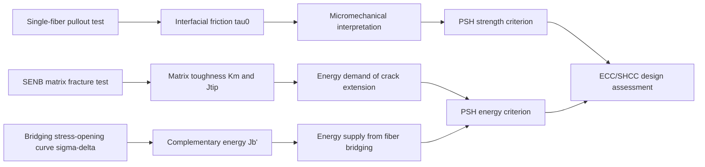

# ECC Micromechanics Calculator & Simulation Engine


A research-oriented computational tool for **Engineered Cementitious Composites (ECC)** / **Strain-Hardening Cementitious Composites (SHCC)**, developed to connect fiber-interface behavior, matrix fracture resistance, fiber-bridging capacity, and pseudo-strain-hardening (PSH) design criteria within one transparent calculation workflow.

本项目不是一个简单的参数计算器，而是一个围绕 ECC 微观力学设计思想构建的 research-grade simulation and evaluation framework。它试图回答一个核心问题：

> **当纤维、界面与基体断裂性能发生变化时，材料是否仍具备稳定多缝开裂与拉伸应变硬化的微观力学条件？**

---

## Research Motivation / 研究出发点

ECC/SHCC 的设计难点并不在于单纯提高抗压强度，而在于在 brittle cementitious matrix 中构建一种可控的裂缝扩展机制，使材料在拉伸荷载下由单裂缝失稳转变为多裂缝稳定演化。

这一转变依赖于三个层级的协同：

1. **Fiber–matrix interface** 需要提供足够但不过度的界面摩擦与滑移阻力；
2. **Matrix fracture toughness** 需要被控制在纤维桥接能力能够稳定补偿的范围内；
3. **Fiber bridging law** 需要在峰值强度与互补能两个维度上同时满足 PSH 条件。

因此，本项目将 ECC 设计问题表述为一个跨尺度计算链：



---

## Scientific Scope / 学术定位

The calculator is designed for researchers working on:

- ECC / SHCC micromechanical design;
- fiber-bridging law analysis;
- interface-tailored cementitious composites;
- matrix fracture toughness evaluation;
- experimental σ–δ curve interpretation;
- parametric exploration of fiber type, volume fraction, aspect ratio, and interfacial properties.

它尤其适合用于比较不同胶凝材料体系、纤维体系或界面调控策略对 PSH potential 的影响。例如：

- 不同矿物掺合料引起的基体断裂韧度变化；
- PE / PVA / Steel 等纤维桥接能力差异；
- 纤维体积分数与长径比对桥接峰值应力的影响；
- 界面摩擦增强是否会带来纤维断裂风险；
- $J_b'$ 与 $J_{tip}$ 的相对变化是否能够解释应变硬化能力差异。

---

## Micromechanical Framework / 微观力学框架

### 1. Interfacial Frictional Bond Stress

The average frictional bond stress is estimated from single-fiber pullout data:

$$
\tau_0 = \frac{P_{\text{peak}}}{\pi d_f L_e}
$$

where:

| Symbol | Meaning | Unit |
|---|---|---|
| $P_{\text{peak}}$ | peak pullout load | N |
| $d_f$ | fiber diameter | mm |
| $L_e$ | embedded length | mm |
| $\tau_0$ | average frictional bond stress | MPa |

这里的 $\tau_0$ 不是孤立参数，而是连接纤维拔出试验与宏观桥接曲线的核心界面变量。它决定单根纤维在裂缝张开过程中的荷载传递能力，也影响纤维是以 pullout 为主还是 rupture 为主。

---

### 2. Matrix Fracture Resistance

Matrix fracture resistance is evaluated from a single-edge-notched beam (SENB) three-point bending configuration:

$$
K_m = \frac{P_{\max}S}{bd^{1.5}}F\left(\frac{a_0}{d}\right)
$$

The geometry correction function $F(a_0/d)$ follows the Gross–Srawley type SENB formulation. The implementation explicitly converts:

$$
\text{MPa}\cdot\sqrt{\text{mm}} \rightarrow \text{MPa}\cdot\sqrt{\text{m}}
$$

The crack-tip energy demand is then calculated as:

$$
J_{tip}=\frac{K_m^2}{E}\quad\text{for plane stress}
$$

or

$$
J_{tip}=\frac{K_m^2}{E/(1-\nu^2)}\quad\text{for plane strain}
$$

This distinction is important because ECC specimens may be interpreted differently depending on geometry, thickness, and boundary condition assumptions. The default setting is `plane_stress`, with $\nu=0.20$.

---

### 3. Fiber-Bridging Complementary Energy

The fiber-bridging curve $\sigma(\delta)$ describes the stress transfer across a crack as crack opening displacement increases. From this curve, the complementary energy is calculated as:

$$
J_b'=\sigma_0\delta_0-\int_0^{\delta_0}\sigma(\delta)d\delta
$$

where $\sigma_0$ is the peak bridging stress and $\delta_0$ is the corresponding crack opening displacement.

Physically, $J_b'$ represents the energy reserve available from fiber bridging beyond the work already consumed along the rising branch. It is therefore a more informative descriptor than peak bridging stress alone. A composite can show high $\sigma_0$ but still fail to maintain stable crack propagation if the bridging curve does not provide sufficient complementary energy.

---

### 4. Pseudo-Strain-Hardening Criteria

The project evaluates the two classical PSH design requirements:

#### Strength criterion

$$
PSH_{strength}=\frac{\sigma_0}{\sigma_{fc}}
$$

This criterion reflects whether the fiber-bridging capacity is sufficient to activate additional cracking after first cracking.

#### Energy criterion

$$
PSH_{energy}=\frac{J_b'}{J_{tip}}
$$

This criterion reflects whether fiber bridging can supply enough energy to sustain steady-state crack propagation.

| Criterion | Suggested design threshold | Micromechanical interpretation |
|---|---:|---|
| $PSH_{strength}$ | $\geq 1.3$ | sufficient stress margin for multiple cracking |
| $PSH_{energy}$ | $\geq 2.7$ | sufficient energy margin for steady-state crack growth |

The two criteria are evaluated simultaneously because strength sufficiency alone does not guarantee strain hardening, and energy sufficiency alone does not guarantee the activation of new cracks.

---

## Computational Modes / 计算模式

### Mode I: Experimental / Imported σ–δ Curve

This mode is intended for formal analysis when the bridging curve is obtained from experiments, inverse analysis, or external numerical simulation.

CSV format:

```csv
delta,sigma
0.0,0.0
0.1,2.3
0.2,4.1
```

| Column | Meaning | Unit |
|---|---|---|
| `delta` | crack opening displacement | mm |
| `sigma` | bridging stress | MPa |

The imported curve is treated as the primary scientific evidence for $\sigma_0$, $\delta_0$, and $J_b'$.

---

### Mode II: Theoretical Bridging Simulation

The simulation mode provides a simplified theoretical estimation of $\sigma(\delta)$ through a double integration of single-fiber pullout response:

$$
\sigma(\delta)=\frac{8V_f}{\pi d_f^2L_f}
\int_0^{\pi/2}\int_0^{L_f/2}P(\delta,l,\theta)\sin\theta\,dl\,d\theta
$$

The single-fiber response can include:

- frictional pullout;
- slip-hardening effect;
- snubbing coefficient;
- fiber rupture cut-off;
- simplified PVA chemical debonding stage;
- simplified hooked-end steel fiber anchorage contribution.

Simulation mode should be interpreted as a **mechanistic sensitivity tool** rather than a substitute for calibrated pullout experiments. Its main value lies in revealing how design variables influence the shape and energy content of the bridging law.

---

## Model Integrity and Reproducibility / 模型一致性与可追溯性

A key design principle of this project is that micromechanical computation must be **traceable, state-aware, and physically interpretable**.

For this reason, every σ–δ curve carries provenance metadata:

- curves imported from CSV are treated as experimental/external data;
- curves generated by the theoretical module are linked to the exact parameter set used to generate them;
- if a parameter that controls the simulated bridging law changes, the previous curve is no longer considered scientifically valid for the current analysis state.

This prevents a common computational error in materials analysis: mixing a newly edited material parameter set with an old response curve. The goal is not merely software robustness, but preservation of the logical consistency between **input parameters → constitutive response → PSH assessment**.

---

## Architecture / 程序结构

```text
ECC-Micromechanics-Calculator
├── core/
│   ├── engine.py        # tau0, Km, Jtip, Jb', PSH criteria
│   └── simulation.py    # theoretical fiber-bridging simulation
├── models/
│   └── project.py       # project and series data model
├── ui/
│   ├── main_window.py   # PySide6 desktop interface
│   ├── workers.py       # threaded computation and IO workers
│   └── plot_widgets.py  # embedded matplotlib visualization
├── utils/
│   ├── io.py            # CSV ingestion and summary export
│   └── export.py        # multi-sheet Excel export
└── tests/               # calculation and reproducibility tests
```

The architecture separates numerical physics from the graphical interface. This makes the calculation engine independently testable and allows the same core functions to be reused in future notebooks, batch scripts, or web-based research tools.

---

## Research-Oriented Output / 输出内容

The software reports:

| Output | Meaning |
|---|---|
| $\tau_0$ | average interfacial frictional bond stress |
| $K_m$ | matrix stress intensity factor |
| $J_{tip}$ | matrix crack-tip energy demand |
| $\sigma_0$ | peak bridging stress |
| $\delta_0$ | crack opening displacement at peak bridging stress |
| $J_b'$ | fiber-bridging complementary energy |
| $PSH_{strength}$ | strength margin for multiple cracking |
| $PSH_{energy}$ | energy margin for steady-state crack growth |

The Excel export includes not only final results, but also raw input parameters and σ–δ curve data, so the numerical conclusion can be traced back to its experimental or simulated origin.

---

## Installation

Basic installation:

```bash
pip install -e .
```

Optional acceleration with Numba:

```bash
pip install -e ".[accel]"
```

Development environment:

```bash
pip install -e ".[dev]"
pytest
```

Run the desktop application:

```bash
ecc-calc
```

or:

```bash
python main.py
```

---

## Suggested Workflow / 推荐使用流程

1. Define a mix-design series or experimental variable.
2. Input single-fiber pullout parameters to estimate $\tau_0$.
3. Input SENB fracture parameters to estimate $K_m$ and $J_{tip}$.
4. Import an experimental σ–δ curve, or generate a theoretical bridging curve for preliminary analysis.
5. Evaluate both $PSH_{strength}$ and $PSH_{energy}$.
6. Compare series-level trends to identify whether interface, matrix toughness, or bridging energy is the limiting factor.
7. Export results for further analysis, plotting, or thesis/report writing.

---

## Model Assumptions and Limitations / 模型假设与边界

This project intentionally keeps the calculation process transparent. The following assumptions should be considered when interpreting results:

- $\tau_0$ is treated as an average frictional bond stress derived from peak pullout load;
- the SENB geometry factor is used within its reasonable crack-depth range;
- $J_{tip}$ depends on the selected plane stress / plane strain assumption;
- imported σ–δ curves should represent the monotonic bridging envelope rather than arbitrary cyclic loading data;
- theoretical simulation is a simplified mechanistic model and should be calibrated against experiments for quantitative prediction;
- PSH thresholds are design indices rather than absolute material laws.

These assumptions are deliberately exposed because meaningful ECC design requires more than numerical output; it requires understanding which physical mechanism controls the final strain-hardening potential.

---

## Academic Use / 学术用途

This project can support:

- ECC/SHCC mix-design screening;
- interpretation of single-fiber pullout tests;
- comparison of matrix fracture toughness among binder systems;
- quantitative discussion of fiber-bridging complementary energy;
- thesis figures and tables for micromechanical design chapters;
- parametric studies linking interface properties to tensile strain-hardening potential.

The broader intention is to make ECC design reasoning computationally explicit: every PSH conclusion should be traceable to a measurable or assumed micromechanical variable.

---

## Contact

For technical inquiries or collaboration:

- **GitHub**: [@liqinglq666](https://github.com/liqinglq666)
- **Email**: liqinglq666@gmail.com
