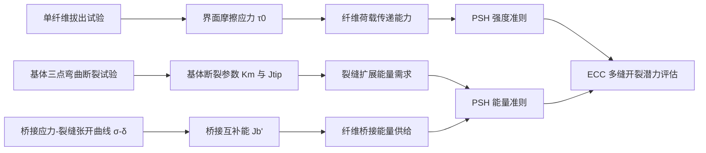
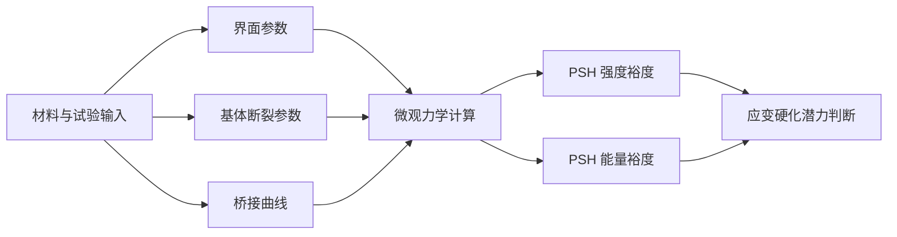

# ECC 微观力学计算与桥接模拟平台


本项目面向 **工程水泥基复合材料（Engineered Cementitious Composites, ECC）** 与 **应变硬化水泥基复合材料（Strain-Hardening Cementitious Composites, SHCC）** 的微观力学设计与计算分析，围绕“纤维—界面—基体—裂缝桥接—伪应变硬化”这一核心链条，构建了一个可追溯、可解释、可扩展的计算平台。

它并不是单纯把公式做成界面，而是试图将 ECC 的材料设计逻辑转化为一个清晰的计算框架：

> **当纤维类型、界面摩擦、基体断裂韧度与桥接曲线发生变化时，材料是否仍然具备稳定多缝开裂与拉伸应变硬化的微观力学条件？**

---

## 1. 研究背景与问题意识

ECC/SHCC 与普通水泥基材料最大的区别，并不是单纯的强度提升，而是在拉伸荷载下能够通过多缝稳定开裂实现显著的变形能力。其关键不在于“裂缝是否出现”，而在于裂缝出现后能否被纤维桥接作用稳定控制，并进一步诱导新的裂缝形成。

从微观力学角度看，ECC 的拉伸应变硬化行为至少受以下三类机制共同控制：

1. **纤维—基体界面作用**：界面摩擦应力需要足够传递荷载，但过强的界面作用又可能诱发纤维断裂，削弱拔出耗能能力；
2. **基体断裂阻力**：基体断裂韧度越高，裂缝扩展所需能量越大，纤维桥接系统需要提供更高的能量储备；
3. **纤维桥接本构关系**：桥接曲线不仅要有足够高的峰值应力，还要有足够的互补能，以支持稳态裂缝扩展。

因此，本项目将 ECC 设计问题理解为一个跨尺度平衡问题：



---

## 2. 项目学术定位

本项目适用于 ECC/SHCC 微观力学设计、纤维桥接行为分析、基体断裂韧度评价以及配合比参数敏感性研究。它更关注“机制解释”而非单点数值输出，适合用于以下研究场景：

- 比较不同胶凝材料体系对基体断裂韧度与 PSH 潜力的影响；
- 分析 PE、PVA、Steel 等不同纤维体系的桥接能力差异；
- 探索纤维体积分数、纤维长度、纤维直径和界面摩擦对桥接曲线的影响；
- 判断高界面粘结是否会带来纤维断裂风险；
- 解释为什么某些材料具有较高初裂强度，却未必表现出良好拉伸延性；
- 将单纤维拔出试验、基体断裂试验与宏观拉伸性能建立定量联系。

项目的核心思想是：**ECC 的设计不能只看强度，也不能只看韧性，而应同时考察强度裕度与能量裕度。**

---

## 3. 微观力学计算框架

### 3.1 界面摩擦应力

单纤维拔出试验用于估算平均界面摩擦应力：

$$
\tau_0=\frac{P_{\text{peak}}}{\pi d_f L_e}
$$

其中：

| 符号 | 含义 | 单位 |
|---|---|---|
| $P_{\text{peak}}$ | 单纤维拔出峰值荷载 | N |
| $d_f$ | 纤维直径 | mm |
| $L_e$ | 有效埋入长度 | mm |
| $\tau_0$ | 平均界面摩擦应力 | MPa |

在 ECC 微观力学设计中，$\tau_0$ 并不是一个孤立参数。它直接影响纤维在裂缝张开过程中的荷载传递能力，并进一步影响桥接曲线的峰值、上升段形态、纤维拔出耗能与断裂风险。

过低的界面摩擦会导致桥接应力不足，难以激活多缝开裂；过高的界面摩擦则可能使纤维在尚未充分拔出耗能前发生断裂。因此，界面调控本质上是一种“荷载传递能力”与“拔出耗能能力”之间的平衡。

---

### 3.2 基体断裂参数

基体断裂阻力通过单边缺口梁（SENB）三点弯曲试验进行估算：

$$
K_m=\frac{P_{\max}S}{bd^{1.5}}F\left(\frac{a_0}{d}\right)
$$

其中 $F(a_0/d)$ 为几何修正函数。程序内部将计算结果从：

$$
\text{MPa}\cdot\sqrt{\text{mm}}
$$

转换为：

$$
\text{MPa}\cdot\sqrt{\text{m}}
$$

基体裂尖能量需求可表示为：

$$
J_{tip}=\frac{K_m^2}{E}\quad\text{平面应力假设}
$$

或：

$$
J_{tip}=\frac{K_m^2}{E/(1-\nu^2)}\quad\text{平面应变假设}
$$

该区分具有重要意义。不同试件厚度、边界条件和断裂解释框架下，平面应力与平面应变会导致不同的裂尖能量需求。当前默认采用平面应力假设，泊松比默认取 $\nu=0.20$。

---

### 3.3 纤维桥接互补能

纤维桥接曲线 $\sigma(\delta)$ 描述裂缝张开位移增加时，跨裂缝纤维系统能够提供的桥接应力。程序根据该曲线提取峰值桥接应力 $\sigma_0$ 及其对应裂缝张开位移 $\delta_0$，并计算桥接互补能：

$$
J_b'=\sigma_0\delta_0-\int_0^{\delta_0}\sigma(\delta)d\delta
$$

$J_b'$ 的物理意义是：纤维桥接系统在峰值点之前能够为稳态裂缝扩展提供的有效能量储备。相比单独使用峰值桥接应力，$J_b'$ 更能反映桥接曲线整体形态对裂缝稳定扩展的贡献。

一个材料体系可能具有较高的 $\sigma_0$，但如果桥接曲线上升过陡、耗能不足，仍可能无法满足稳定裂缝扩展所需的能量条件。因此，本项目将 $J_b'$ 作为判断 ECC 应变硬化潜力的核心能量指标。

---

### 3.4 伪应变硬化双准则

ECC/SHCC 的多缝开裂能力通常需要同时满足强度准则与能量准则。

#### 强度准则

$$
PSH_{strength}=\frac{\sigma_0}{\sigma_{fc}}
$$

其中 $\sigma_{fc}$ 为复合材料初裂强度。该准则用于判断桥接峰值应力是否足以在首条裂缝形成后继续承担荷载，并诱导新的裂缝产生。

#### 能量准则

$$
PSH_{energy}=\frac{J_b'}{J_{tip}}
$$

该准则用于判断纤维桥接系统提供的互补能是否足以抵抗基体裂尖扩展所需能量。

| 判据 | 建议阈值 | 微观力学含义 |
|---|---:|---|
| $PSH_{strength}$ | $\geq 1.3$ | 桥接强度相对初裂强度具有足够裕度 |
| $PSH_{energy}$ | $\geq 2.7$ | 桥接能量相对裂尖能量需求具有足够裕度 |

强度准则与能量准则必须同时考虑。仅满足强度准则并不意味着裂缝能够稳定扩展；仅满足能量准则也不意味着新裂缝能够被有效激活。二者共同决定 ECC 是否具备稳定多缝开裂潜力。

---

## 4. 计算模式

### 4.1 实验曲线导入模式

该模式适用于正式分析。用户可以导入由实验、反演分析或外部数值模型得到的桥接应力—裂缝张开曲线。

CSV 文件格式如下：

```csv
delta,sigma
0.0,0.0
0.1,2.3
0.2,4.1
```

| 列名 | 含义 | 单位 |
|---|---|---|
| `delta` | 裂缝张开位移 | mm |
| `sigma` | 桥接应力 | MPa |

在该模式下，导入曲线被视为 $\sigma_0$、$\delta_0$ 与 $J_b'$ 的主要数据依据。程序会对曲线进行基本清洗与一致性检查，以保证积分和峰值识别具有明确的物理含义。

---

### 4.2 理论桥接模拟模式

理论模拟模式用于在缺少完整实验桥接曲线时进行机理分析和参数敏感性研究。程序基于单纤维拔出响应进行双重积分，估算宏观桥接应力曲线：

$$
\sigma(\delta)=\frac{8V_f}{\pi d_f^2L_f}
\int_0^{\pi/2}\int_0^{L_f/2}P(\delta,l,\theta)\sin\theta\,dl\,d\theta
$$

模型中可考虑：

- 纤维摩擦拔出；
- 滑移硬化效应；
- 倾角 snubbing 效应；
- 纤维拉断截断；
- PVA 纤维的简化化学脱粘阶段；
- 端钩钢纤维的简化锚固贡献。

需要强调的是：理论模拟模式更适合作为 **mechanistic sensitivity tool**，用于观察参数变化对桥接曲线形状、峰值应力和互补能的影响。若用于定量预测，应结合单纤维拔出试验或直接拉伸试验进行校准。

---

## 5. 模型一致性与可追溯性

材料计算中一个容易被忽视的问题是：输入参数、桥接曲线与最终 PSH 评价之间必须保持逻辑一致。如果修改了纤维参数、界面参数或模拟参数，却继续使用旧的桥接曲线，最终结果虽然可以被计算出来，但其物理含义已经不成立。

因此，本项目将“可追溯性”作为计算框架的一部分：

- 导入的实验曲线会被视为外部数据源；
- 理论模拟曲线会记录生成该曲线时对应的参数组合；
- 当影响桥接曲线的参数发生变化时，旧曲线不再被视为当前材料状态下的有效响应；
- 最终导出结果会同时保留输入参数、桥接曲线与计算指标。

这样做的目的不是为了显示软件细节，而是为了保证材料分析中的因果链条保持清晰：



---

## 6. 输出指标

程序输出的主要结果如下：

| 输出指标 | 含义 | 学术解释 |
|---|---|---|
| $\tau_0$ | 平均界面摩擦应力 | 反映纤维—基体界面荷载传递能力 |
| $K_m$ | 基体应力强度因子 | 表征基体裂纹扩展阻力 |
| $J_{tip}$ | 裂尖能量需求 | 表征基体裂缝稳态扩展所需能量 |
| $\sigma_0$ | 峰值桥接应力 | 表征纤维桥接系统最大承载能力 |
| $\delta_0$ | 峰值对应裂缝张开位移 | 反映桥接峰值出现时的裂缝开口尺度 |
| $J_b'$ | 桥接互补能 | 表征纤维桥接系统可用于裂缝稳定扩展的能量储备 |
| $PSH_{strength}$ | 强度裕度 | 判断是否具备继续激活新裂缝的应力条件 |
| $PSH_{energy}$ | 能量裕度 | 判断是否具备稳态裂缝扩展的能量条件 |

这些指标不是孤立存在的。真正有价值的分析并不是简单判断“通过”或“不通过”，而是进一步识别限制材料延性的主控因素：是界面过弱、基体过韧、桥接能不足，还是峰值桥接强度不够。

---

## 7. 程序结构

```text
ECC-Micromechanics-Calculator
├── core/
│   ├── engine.py        # τ0、Km、Jtip、Jb'、PSH 判据计算
│   └── simulation.py    # 理论纤维桥接曲线模拟
├── models/
│   └── project.py       # 项目与试验序列数据结构
├── ui/
│   ├── main_window.py   # PySide6 桌面交互界面
│   ├── workers.py       # 后台计算与文件读写线程
│   └── plot_widgets.py  # matplotlib 嵌入式绘图模块
├── utils/
│   ├── io.py            # CSV 数据导入与清洗
│   └── export.py        # 多工作表 Excel 导出
└── tests/               # 核心计算与可追溯性测试
```

项目将数值计算核心与图形界面分离，使 `core` 中的计算函数可以独立测试、复用和扩展。后续可以进一步迁移到 Jupyter Notebook、批处理脚本、Web 应用或论文数据分析流程中。

---

## 8. 安装与运行

基础安装：

```bash
pip install -e .
```

启用 Numba 可选加速：

```bash
pip install -e ".[accel]"
```

开发与测试环境：

```bash
pip install -e ".[dev]"
pytest
```

运行桌面程序：

```bash
ecc-calc
```

或：

```bash
python main.py
```

---

## 9. 推荐使用流程

1. 建立一个或多个材料序列，例如不同纤维掺量、不同胶凝材料组成或不同界面处理方案；
2. 输入单纤维拔出参数，计算界面摩擦应力 $\tau_0$；
3. 输入基体三点弯曲断裂参数，计算 $K_m$ 与 $J_{tip}$；
4. 导入实验 σ–δ 曲线，或使用理论桥接模拟生成初步曲线；
5. 计算 $J_b'$、$PSH_{strength}$ 和 $PSH_{energy}$；
6. 比较不同序列下强度裕度与能量裕度的变化；
7. 判断限制 ECC 拉伸延性的主控因素；
8. 导出结果，用于论文、报告或进一步数据分析。

---

## 10. 模型假设与适用边界

为了保证计算过程清晰可解释，本项目保留并显式呈现以下假设：

- $\tau_0$ 被视为由单纤维拔出峰值荷载反推得到的平均界面摩擦应力；
- SENB 几何修正公式应在合理裂缝深度范围内使用；
- $J_{tip}$ 的计算结果依赖于平面应力或平面应变假设；
- 导入的 σ–δ 曲线应代表单调桥接包络，而不是任意循环加载路径；
- 理论桥接模拟是简化机理模型，定量预测前应结合试验进行校准；
- PSH 阈值属于材料设计判据，不应被理解为绝对失效边界。

这些边界并不是项目缺陷，而是微观力学建模中必须被明确说明的前提。只有清楚知道模型假设，计算结果才具有学术解释价值。

---

## 11. 学术用途

本项目可服务于以下工作：

- ECC/SHCC 配合比设计与筛选；
- 单纤维拔出试验结果解释；
- 基体断裂韧度对拉伸延性的影响分析；
- 纤维桥接互补能计算与对比；
- PE、PVA、Steel 等不同纤维体系的桥接机制比较；
- 胶凝材料组成差异对 PSH 潜力的影响分析；
- 毕业论文或研究报告中的微观力学计算章节；
- 将实验数据、理论公式与可视化结果整合为可复现分析流程。

项目的更深层目标，是把 ECC 设计从“经验配合比筛选”推进到“机制约束下的定量设计”：每一个 PSH 判断都应能追溯到具体的界面参数、基体断裂参数与桥接曲线特征。

---

## 12. 联系方式

如需交流模型、算法或 ECC/SHCC 微观力学设计问题，可联系：

- **GitHub**: [@liqinglq666](https://github.com/liqinglq666)
- **Email**: liqinglq666@gmail.com
